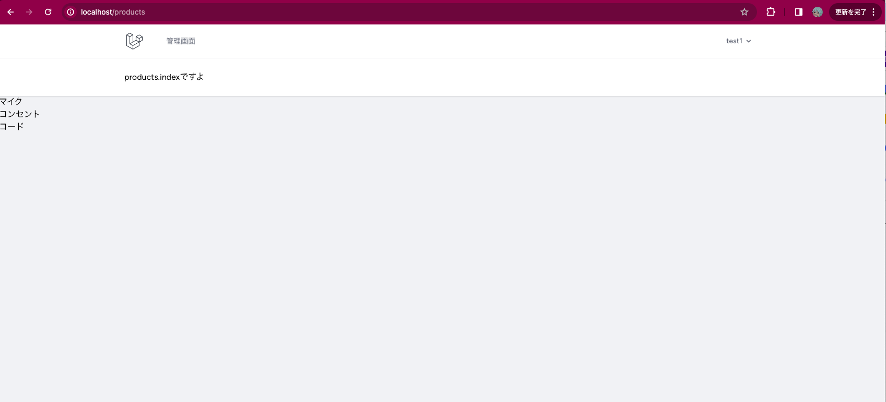

## 【小テスト】Laravelの教科書　CHAPTER3 Laravelの仕組み


## 問題1: ルーティングとコントローラー

Laravelにおいて、ウェブアプリケーションでユーザーからのリクエストを受け取り、特定のコントローラーのアクションにルーティングする基本的な方法を説明してください。

また、/productsというURLにGETリクエストが来た時にProductControllerのindexメソッドを呼び出すルーティングを設定するコード例を書いてください。

### 説明

基本的に `routes/web.php` ファイルでルートを定義する。

特定のコントローラーのアクションにルーティングするには、ルートにコントローラー名とアクション名を記載する

仮に、userコントローラーのshowアクションへのルーティングの場合

````
Route::get('/user', [UserController::class, 'show']);
````

のようになる。


### ProductControllerのindexメソッドへのルーティングのコード例

・routes/web.php　に以下を追加
````
use App\Http\Controllers\ProductController;

...

Route::get('/products',[ProductController::class, 'index']);

````

## 問題2: ビューとデータの受け渡し
Laravelにおいて、コントローラーからビューにデータを渡す一般的な方法を説明し、商品のリストを表示するためにProductControllerのindexメソッドからビューproducts.indexに商品データの配列を渡すコード例を書いてください。

### 方法の説明

compact()などを使うことで、View側ではController側で作成した変数を渡すことが可能になる。（今回はこれを使用する方法）

### 変更・追加したファイル、処理


・app/Http/Controllers/ProductController.php　を作成し以下を追加

````
namespace App\Http\Controllers;


class ProductController extends Controller{
    // 小テスト３用
    public function index(){
        $items = [
            'マイク', 'コンセント', 'コード'
        ];

        return view('products.index', compact('items'));
    }
}
````

・resources/views/products/index.php　を作成し以下を追加

````
<x-app-layout>
    <x-slot name="header">
        <h2>
            {{ __('products.indexですよ') }}
        </h2>
    </x-slot>

    <div class="">
        @foreach($items as $item)
            <ul>
                <li>{{$item}}</li>
            </ul>
        @endforeach
    </div>

</x-app-layout>

````

### 結果

