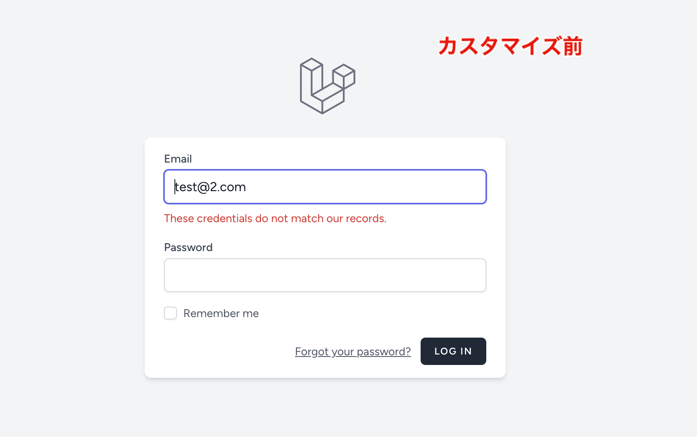
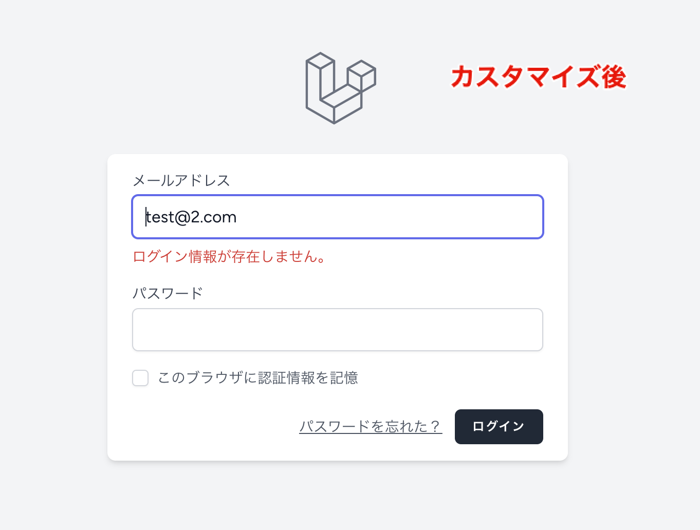
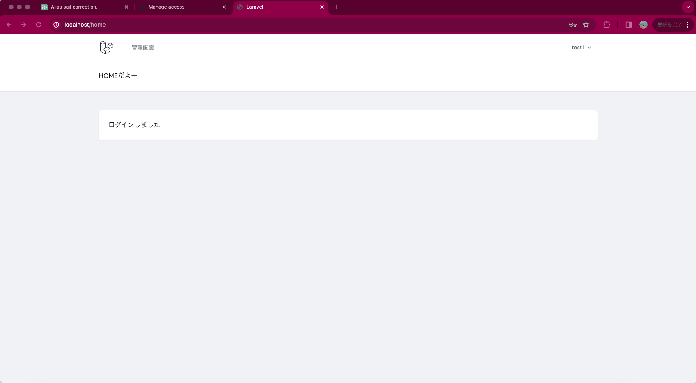

# 問題: Laravel Breezeを使用したログイン機能のカスタマイズ

あなたは、Laravel Breezeを使って構築された新しいLaravelアプリケーションにおいて、既存のログイン機能をカスタマイズしたいと考えています。

具体的には、ユーザーがログインに失敗した際に表示されるエラーメッセージをカスタマイズし、さらにログイン成功後のリダイレクト先をデフォルトのダッシュボードページから異なるページに変更したいと思っています。

このカスタマイズを実装するためのステップを説明してください。

## 「エラーメッセージ」のカスタマイズ手順

エラーメッセージのカスタマイズ方法はいくつかあると思うが、今回は「日本語化」と捉えて、その方法を。

### config/app.phpの編集

・'local' => en, を　'local' => ja　に変更

・Laravel v10を使用しているため、「artisan lang:publish」で言語ファイルを作成

・ルート/lang/en をコピーして、jaディレクトリを、ルート/lang/に ja.jsonを作成

・「composer require askdkc/breezejp --dev」「artisan breezejp」を実行して、Laravel Breezeを日本語化。

### 結果

## ログイン後のリダイレクト先の変更

今回編集・追加したファイル

・app/Providers/RouteServiceProvider.php　でリダイレクト先を変更

・routes/web.php でルーティングの設定

・resources/views/にhome.blade.php（任意のリダイレクト先）を追加

### 結果

